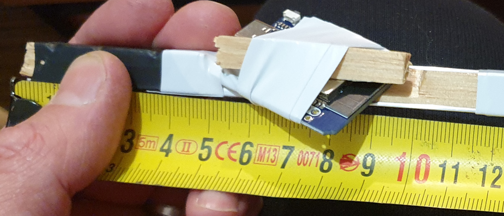

# Massues lumineuses DIY avec WLED

**Travail de documentation en cours**

Ce tuto décrit comment fabriquer une massue lumineuse controllable par le logiciel WLED, il est possible de changer les couleurs
depuis les massues, mais aussi depuis un téléphone ou PC. Des séquences peuvent également être programmées.

## Le principe

Ces massues sont composée de :
- un axe en bois ou bois+alu
- la lumière est générée par un ruban LED de 120 LED RGB, plié en 4 pour faire le tour de l'axe
- une batterie Li-ion de 3.7v 3000mah permet d'avoir une heure d'autonomie et de la recharger
- un petit circuit alimenté par la batterie fourni une alimentation constante de 5 V car la batterie a une tension variant entre 2.5v et 4.2v
- une petite carte électronique ESP32 permet de piloter les LED et de pouvoir être controlé par Wifi, ou en touchant la vis supperieur de la massue
- la vis en haut de la massue permet de changer de style lorsqu'elle est touchée.

## Liste du matériel :

- 1 bouteille de Perrier "finement pétillantes" 1 L 0.61€ la bouteille chez Leclerc (0.61€ / massue)
- 1 petite bouteille de Perrier "finement pétillantes" de 50 cl pour la jointure au niveau du manche. 0.57€ la bouteille chez Leclerc (0.57€ / massue)
- 1 bouteille de 1 L pour le manche ou d'autre choix... (0.50€ ? / massue)
- 123 LED de ruban sur 2 mètres de type WS2812B RGB, 60 LED par mètre . 21€ les 5m sur Amazon (10.50€ / massue) 8.59 € les 5 mètres sur ALiexpress
- carte ESP32 compatible WLED : Diymore mini D1 ESP32-WROOM-32 Puce CH9102F 13.98€ les 3 sur Amazon, 3.90€ sur AliExpress (4.66€ / massue)
- Mini DC-DC Boost 3.7v à 5v. 6.96€ les 5 sur Amazon, 1.29€ les 10 sur AliExpress (1.39€ / massue)
- 2 coins de table, 7.99€ les 30 sur Amazon (0.53€ / massue)
- (facultatif) prise JST 9.98€ les 50 paires sur Amazon, peut etre recup de la batterie (0.20€ / massue)
- Bouton poussoir. 8,48€ les 24 sur Amazon (0.35€ / massue)
- batterie Li-ion 18650 3000 mAh. 16.99€ les 4 sur Amazon (4.25€ / massue) 13.88€ les 10 sur AliExpress
- 2 vis à bois et 2 rondelles pour les extrémités du tourillon
- fil électrique
- gaine thermo
- scotch d'électricien

Pour l'axe, soit :
- en bois :
  - tourillon bois de 18 de diamètre, 51 cm de long pour la structure et le manche. Tourillon raboté pin ø18 mm L.2,4 m 7.40€ chez Castorama (1.85€ / massue)
- soit en alu+bois :
  - CORNIERE 10X10 ALU BRUT 2M 5.59€  50 cm de long (1.4€ / massue)
  - TASSEAU AYOUS RABOTE 9X9X2000 2.99€ moins de 50 cm de long  (0.75€ / massue)
  - colle à chaud

Au total
- 25.41€ par massue par Amazon
- 14.14€ par AliExpress

### Tableau du matériel

| Materiel                                                       | Quantité/taille                                          | Prix            | Nb massue   | Prix  / massue   |
|----------------------------------------------------------------|----------------------------------------------------------|-----------------|-------------|------------------|
| 1 bouteille de Perrier "finement pétillantes"                  | 1 L la bouteille chez Leclerc                            | 0.61€           | 1           | 0.61€            |
| 1 petite bouteille de Perrier "finement pétillantes" de 50 cl  | la bouteille chez Leclerc                                | 0.57€           | 1           | 0.57€            |
| 1 bouteille de 1 L pour le manche ou d'autre choix...          |                                                          |                 |             | 0.50€ ?          |
| 123 LED de ruban sur 2 mètres de type WS2812B RGB, 60 LED/m    | 5m  21€  Amazon/ 8.59 €  ALiexpress                      | 10.50€/8.59 €   | 2           | 10.50€ / 4.30€   |
| carte ESP32 compatible WLED : Diymore mini D1 ESP32-WROOM-32   | 13.98€ les 3 sur Amazon, 3.90€ sur AliExpress            | 13.98€          | 3           | 4.66€/3.90€      |
| Mini DC-DC Boost 3.7v à 5v                                     | 6.96€ les 5 sur Amazon, 1.29€ pour 10 AliExpress         | 6.96€           | 5           | 1.29€            |
| 2 coins de table                                               | 7.99€ les 30 sur Amazon                                  | 7.99€           | 15          | 0.53€            |
| (facultatif) prise JST                                         | 9.98€ les 50 paires sur Amazon                           | 9.98€           | 50          | 0.20€            |
| Bouton poussoir                                                | 8.48 € les 24 sur Amazon                                 | 8.48 €          | 24          | 0.35€            |
| batterie Li-ion 18650 3000 mAh                                 | 16.99€ les 4 sur Amazon / 13.88€ les 10 sur AliExpress   | 16.99€          | 4           | 4.25€            |
| 2 vis à bois et 2 rondelles pour les extrémités du tourillon   |                                                          |                 |             |                  |
| fil électrique                                                 |                                                          |                 |             |                  |
| gaine thermo                                                   |                                                          |                 |             |                  |
| scotch d'électricien                                           |                                                          |                 |             |                  |
| -----   ↓↓↓↓       Version axe en bois           ↓↓↓↓    ----- |                                                          |                 |             |                  |
| tourillon bois de 18 de diamètre, 51 cm de long                | L.2,4 m chez Castorama                                   | 7.40€           | 4           | 1.85€            |
| -----   ↓↓↓↓  Version axe en alu et bois         ↓↓↓↓    ----- |                                                          |                 |             |                  |
| CORNIERE 10X10 ALU BRUT                                        | 2M 5.59€             chez Castorama                      | 5.59€           | 4           | 1.4€             |
| TASSEAU AYOUS RABOTE 9X9X2000                                  | 2.99€ chez Castorama                                     | 2.99€           | 4           | 0.75€            |
| colle à chaud                                                  |                                                          |                 |             |                  |

### Outillage

- Scie à métaux/dremelle
- baton de colle à chaud
- TODO à compléter

### L'assemblage (version alu+bois)

- Découper 50 cm de la cornière alu 10x10 avec une scie a métaux (par ex)
- découper 15 cm et 28.5 cm dans le tasseau 9x9 TODO : mettre les dimensions d'origine
- sur le morceau de 15cm, faire un biseau entre 5 et 10 cm
- coller les tasseaux sur l'alu en plaçant de petits morceaux de baton de colle à chaud sur l'alu et chauffer au décapeur thermique pour que la colle fonde sur l'alu.
Les tasseaux doivent être sur les extrémités, la batterie 18650 (=18 mm de diamètre 65 mm de haut) doit rentrer entre les 2 morceaux.
- fixer la batterie avec de la gaine thermique
- TODO :
  - fixer prise de recharge avec de la gaine thermique
  - fixer interrupteur avec de la gaine thermique
  - souder le boost 5v
  - souder la carte ESP32
  - fixer les cables
  - scotcher le ruban led ces rubans ont un scotch double-face déjà en place
  - souder les fils au ruban led
  - faire le  contour du manche
  - couper et ajouter le bulbe
  - ajouter la base (les 2 coins de table)

## Bulbe fibré (optionnel)

## La partie Logiciel (WLED)

TODO

### l'installation en USB

https://install.wled.me/

#### le wifi

Pour contrôler les massues depuis un smartphone ou un PC,
il faut définir un réseau Wifi auquel les massues essayeront de se connecter.

Ce réseau wifi sera aussi utile si l'on souhaite que les masques se synchronise entre elle. 

### la configuration

#### les segments

#### les presets

### l' utilisation

## Les problèmes rencontrés

### Tourillon fragilisé par le sillon

### Inter coulissant instable sur les chocs

- interrupteur coulissant 3 broches. 8.99 € les 100 sur Amazon (0.09€ / massue)

Remplacé par :

### Ruban coupé par la batterie

### Le contrôleur intégré à la batterie coupe l'alimentation

TODO
